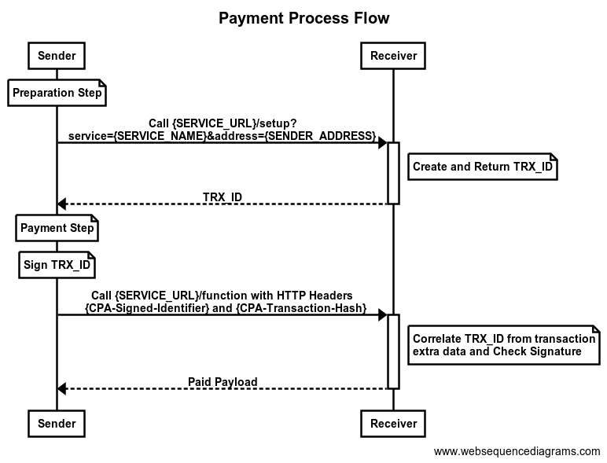

# Receiver Implementation for Payable Services

Read more about this Payable API implementation here: http://blockchainers.tech/pay-robots-with-crypto-money/

This project implements the Receiver ("Server") of payments requested by the [crypyapi-sender](https://github.com/ice09/crypyapi-sender). A new Receiver implementation would clone this repo and look into `BestJokeEverController` and `BestJokeEverService` for usage.

## New Payment Receivers Setup

The Payment Receipt is transferred via HTTP Headers, so the service calls do not have to know about the Payment part. This is proxied by the `BestJokeEverController`.  
A customer implementation of this Controller must

* Extend `ServiceControllerProxy`
* Inject `CorrelationService`, `SignatureService`, `Credentials` which are configured (see Configuration)
* Add the Endpoints with the `Payable` metadata and the HTTP Headers for Payment Receipts (see Implementation)

### Receiver Configuration

This project uses Spring Boot, but the process flow can easily be reused in other Java projects or even ported to other platforms like .NET, Python etc.

#### Properties

All properties are defined in `crypyapi-receiver.properties`.

The only relevant property for a custom implementation is 

    # Use Sokol Testnet
    ethereum.rpc.url=https://sokol.poa.network

* The RPC URL must be known and can be any valid EVM Chain, we use Testnet URLs only for the POA Network.

### Receiver Implementation

Most of the tricky parts will be handled by the framework. The process flow is handled by the crypyapi-sender. 

#### Payable Service Proxy Implementation

The extended `ServiceControllerProxy` must implement the Endpoint with the Payment metadata and HTTP Headers:

    @Payable(service = "chuckNorrisService", currency=Currency.USD, equivalentValueInWei=100, accepted={StableCoin.DAI, StableCoin.XDAI})
    public String requestService(@RequestHeader("CPA-Transaction-Hash") String trxHash, @RequestHeader("CPA-Signed-Identifier") String signedTrxId) {

The HTTP Headers will be verified by Aspects which are configured automatically on application startup.

_Note: The final service URL and the service name (*"chuckNorrisService"*) must be available to the Sender implementation._
